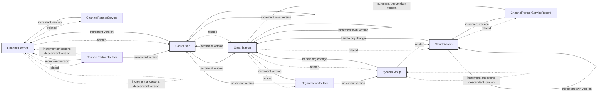

# Overview

This document describes the caching strategy used in the Channel Partners application.

# Caching Strategy

> In-progress

# Components

## Mixins

### Notes

- [Related directly to a comment on `increment_version_by_id`](https://gitlab.nxvms.dev/dev/cloud_portal/-/merge_requests/8129#note_788028)
    - If method function fails, cache won't be updated, related object version won't be updated, but actual object data is updated, in case if Model.save() has been called from out atomic transaction. Not a big problem, but we need to be aware of this.

## Receivers
### Flow
