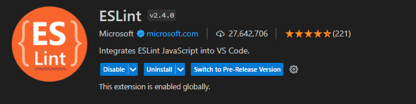
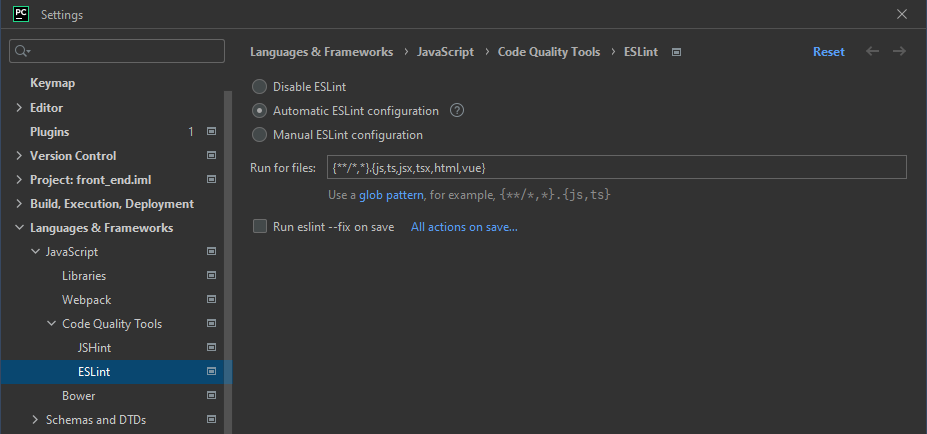

# `front_end` Linting

## IDE Setup
### ESLint
For VS Code, install the ESLint extension.

For PyCharm, "Automatic ESLint configuration" should work out of the box. For front end, we want linting for `js`, `ts`, and `html` files. Add them if they are missing from the "Run for files" input.

Depending on preference, you should set up either autofix (a file) on save, or a keyboard shortcut for autofix.

### Prettier
Prettier is managed by the plugin for ESLint, so once the node packages are installed no additional setup is required. However, other plugins/extensions for Prettier will format files they shouldn't since those don't use the `.eslintrc.js` config file.

For VS Code, disable the Prettier extension and any other Prettier related extensions.

For PyCharm, disable the Prettier plugin under **Languages and Frameworks > JavaScript > Prettier**.

## Scripts
For linting all files, using single threaded `eslint --ext .ts --fix` is very slow because of how much code there is; The multithreaded linting npm scripts should be used instead.

- `npm run esprint` is the maximum power option which will try to spawn as many threads as there are physical CPU cores or RAM available, whichever is less. Each thread will consume 1.0-1.2 GB of RAM.
- `npm run esprint4` and `npm run esprint8` will spawn 4 and 8 threads respectively. These will not warn you if they need more RAM than is free.
