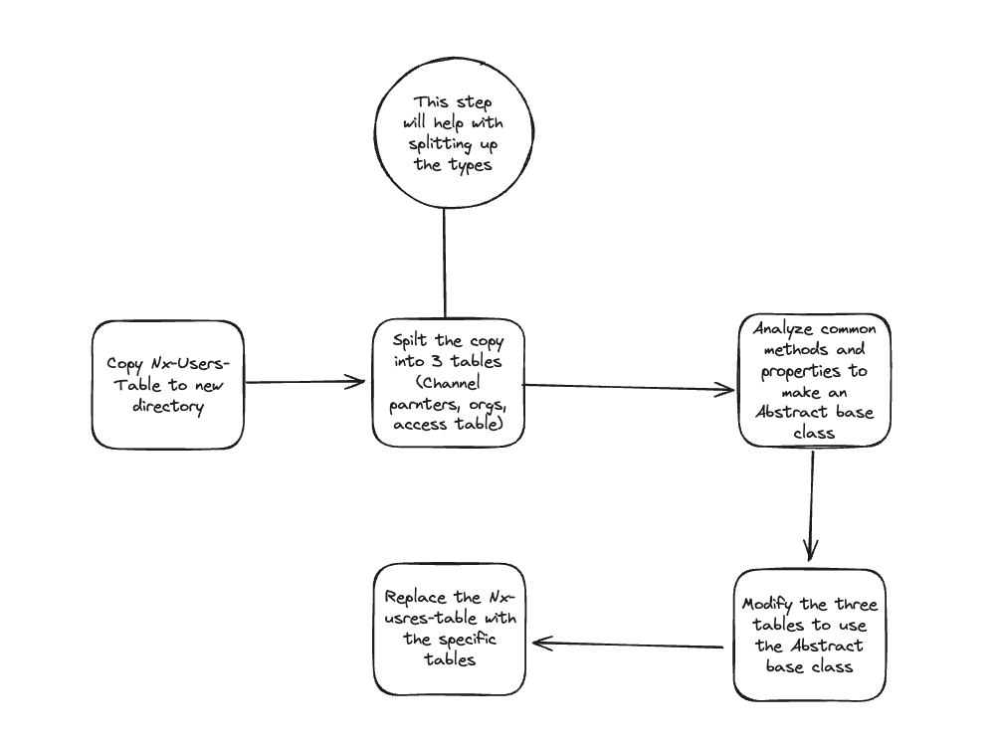

# User Table Refactor

## Objective

Currently the NxUsersTableComponent is handling too many responsibilities which leads to a lot of branching logic
which can cause bugs and make the component harder to maintain.

The goal of this refactor is to break down the
NxUsersTableComponent into smaller components that handle a single responsibility and move shared behavior into
either an abstract class or a hostDirective.

A host directive is probably the most correct way but would be a larger refactor. For the initial refactor it will
probably be easiest to stick with an abstract class which can then be made into a host directive later.

## Strategy

We'll be following the strangler pattern to allow us to refactor the component in smaller pieces. We divide the
refactor in a couple different ways.

1. **Incrementally including components into refactor** - The concrete implementations extends either the
InitialUserTable class or the AbstractUserTableDirective class. The classes that extend AbstractUserTableDirective
are the ones currently being refactored, the classes that extend InitialUserTable are the ones not yet being included
in the refactor. This will allow us to incrementally work on the correct abstraction for AbstractUserTableDirective.
2. **Incrementally update template and styles** - Initially the templates and styles for all the components will be
copied from NxStranglerUsersTableComponent. Most likely styles can continue to be shared between all the components but
templates will need to be specific to each component to remove a lot of the branching logic.
3. **Remove strangler component** - Once all the strangler-table folder, the only thing left that should have any
references would be the scss file. That can be moved to the shared folder.
4. **Update AbstractUserTableDirective to be a host directive** - Once all the components have been refactored we can
maybe move AbstractUserTableDirective to be a host directive to even better encapsulate the shared behavior.

## Steps

With the strangler pattern there's less coupling to the refactoring steps so we can be a bit more flexible.
Either a component can be refactored entirely, all the templates refactored first, or the abstract class can
can be worked on first.
